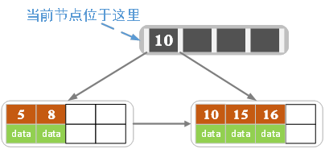
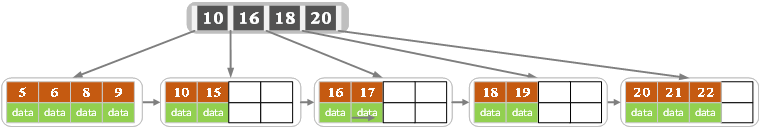
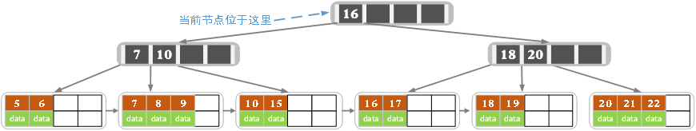
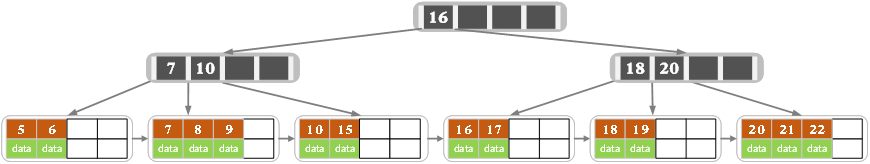
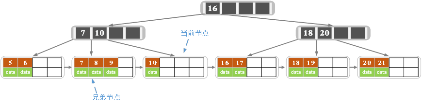
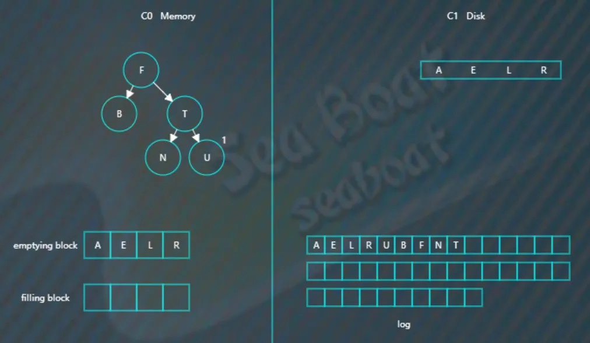

# B Tree B+ Tree 与 LSM Tree

# B树
-----
## 背景
&emsp;动态查找树主要有：[二叉查找树（Binary Search Tree）](http://blog.csdn.net/qq_35644234/article/details/64516551)，[平衡二叉查找树（Balanced Binary Search Tree）](http://blog.csdn.net/qq_35644234/article/details/66476853)，红黑树(Red-Black Tree )，B-tree/B+-tree/ B*-tree (B~Tree)。前三者是典型的二叉查找树结构，其查找的时间复杂度O(log2N)与树的深度相关，那么降低树的深度自然会提高查找效率。

​	就是大规模数据存储中，实现索引查询这样一个实际背景下，树节点存储的元素数量是有限的（如果元素数量非常多的话，查找就退化成节点内部的线性查找了），这样导致**二叉查找树结构由于树的深度过大而造成磁盘I/O读写过于频繁，进而导致查询效率低下**，那么如何减少树的深度，一个基本的想法就是：**采用多叉树结构**（由于树节点元素数量是有限的，自然该节点的子树数量也就是有限的）。

​	这样我们就提出了一个新的查找树结构——多路查找树。根据平衡二叉树的启发，自然就想到平衡多路查找树结构，也就是这篇文章所要阐述的第一个主题B-tree，即B树结构(**B树的各种操作能使B树保持较低的高度，从而达到有效避免磁盘过于频繁的查找存取操作，从而有效提高查找效率**)

## 性质

一棵m阶B树(balanced tree of order m)是一棵平衡的m路搜索树。它或者是空树，或者是满足下列性质的树：

1、根结点关键字满足1<=k <= m - 1。

2、每个非根节点所包含的关键字个数k满足：Math.ceil(m/2)-1 <=k <= m - 1；

3、分支数量=关键字数+1，故分支数量c满足：Math.ceil(m/2) <= c <= m ；

4、每个结点中的关键字都按照从小到大的顺序排列，每个关键字的左子树中的所有关键字都小于它，而右子树中的所有关键字都大于它。

5、所有的叶子结点都位于同一层，或者说根结点到每个叶子结点的长度都相同。。

## 操作

假定对高度为h的m阶B树进行操作。

### 插入

新结点一般插在第h层，通过搜索找到对应的结点进行插入，那么根据即将插入的结点的数量又分为下面几种情况。

- 如果该结点的关键字个数没有到达m-1个，那么直接插入即可；
- 如果该结点的关键字个数已经到达了m-1个，那么根据B树的性质显然无法满足，需要将其进行分裂。分裂的规则是该结点分成两半，将中间的关键字进行提升，加入到父亲结点中，但是这又可能存在父亲结点也满员的情况，则不得不向上进行回溯，甚至是要对根结点进行分裂，那么整棵树都加了一层。

其过程如下：

### 删除

同样的，我们需要先通过搜索找到相应的值，存在则进行删除，需要考虑删除以后的情况，

- 如果该结点拥有关键字数量仍然满足B树性质，则不做任何处理；

- 如果该结点在删除关键字以后不满足B树的性质（关键字没有到达ceil(m/2)-1的数量），则需要向兄弟结点借关键字，这有分为兄弟结点的关键字数量是否足够的情况。

  - 如果兄弟结点的关键字足够借给该结点，则过程为将父亲结点的关键字下移，兄弟结点的关键字上移；
  - 如果兄弟结点的关键字在借出去以后也无法满足情况，即之前兄弟结点的关键字的数量为ceil(m/2)-1，借的一方的关键字数量为ceil(m/2)-2的情况，那么我们可以将该结点合并到兄弟结点中，合并之后的子结点数量少了一个，则需要将父亲结点的关键字下放，如果父亲结点不满足性质，则向上回溯；

- 其余情况参照BST中的删除。

其过程如下：

------

# B+树

​	由于B+树的数据都存储在叶子结点中，分支结点均为索引，方便扫库，只需要扫一遍叶子结点即可，但是B树因为其分支结点同样存储着数据，我们要找到具体的数据，需要进行一次中序遍历按序来扫，所以B+树更加适合在区间查询的情况，所以通常B+树用于数据库索引，而B树则常用于文件索引。B+树与B树最大的不同是内部结点不保存数据，只用于索引，所有数据（或者说记录）都保存在叶子结点中。

## 性质

1. 根结点只有一个，关键字数量范围为[1，m-1]；
2. 除根结点，内部结点关键字的数量范围为[ceil(m/2)-1, m-1]，关键字顺序递增；
3. 分支数=关键字数+1，，每个结点包含分支数范围为[ceil(m/2), m]；
4. 内部结点中的key都按照从小到大的顺序排列，对于内部结点中的一个key，左树中的所有key都**小于**它，右子树中的key都**大于等于**它。叶子结点中的记录也按照key的大小排列。
5. 所有叶子结点都在同一层，每个叶子结点都存有相邻叶子结点的指针，叶子结点本身依关键字的大小自小而大顺序链接。

## 操作

其操作和B树的操作是类似的，不过需要注意的是：

在增加值的时候，如果存在满员的情况，将选择结点中的值作为新的索引，加入到父节点，并且结点中的值不会因为作为了索引而减少，只是父结点关键字增多，会对子结点进行了拆分。

#### B+树的插入操作

1）若为空树，创建一个叶子结点，然后将记录插入其中，此时这个叶子结点也是根结点，插入操作结束。

2）针对叶子类型结点：根据key值找到叶子结点，向这个叶子结点插入记录。插入后，若当前结点key的个数小于等于m-1，则插入结束。否则将这个叶子结点分裂成左右两个叶子结点，左叶子结点包含前m/2个记录，右结点包含剩下的记录，将第m/2+1个记录的key进位到父结点中（父结点一定是索引类型结点），进位到父结点的key左孩子指针向左结点,右孩子指针向右结点。将当前结点的指针指向父结点，然后执行第3步。

3）针对索引类型结点：若当前结点key的个数小于等于m-1，则插入结束。否则，将这个索引类型结点分裂成两个索引结点，左索引结点包含前(m-1)/2个key，右结点包含m-(m-1)/2个key，将第m/2个key进位到父结点中，进位到父结点的key左孩子指向左结点, 进位到父结点的key右孩子指向右结点。将当前结点的指针指向父结点，然后重复第3步。

下面是一颗5阶B树的插入过程，5阶B数的结点最少2个key，最多4个key。

------

a）空树中插入5

------

b）依次插入8，10，15

------

c）插入16

插入16后超过了关键字的个数限制，所以要进行分裂。在叶子结点分裂时，分裂出来的左结点2个记录，右边3个记录，中间key成为索引结点中的key，分裂后当前结点指向了父结点（根结点）。结果如下图所示。

当然我们还有另一种分裂方式，给左结点3个记录，右结点2个记录，此时索引结点中的key就变为15。

------

d）插入17

------

e）插入18，插入后如下图所示

当前结点的关键字个数大于5，进行分裂。分裂成两个结点，左结点2个记录，右结点3个记录，关键字16进位到父结点（索引类型）中，将当前结点的指针指向父结点。

当前结点的关键字个数满足条件，插入结束。

------

f）插入若干数据后

------

g）在上图中插入7，结果如下图所示

当前结点的关键字个数超过4，需要分裂。左结点2个记录，右结点3个记录。分裂后关键字7进入到父结点中，将当前结点的指针指向父结点，结果如下图所示。

当前结点的关键字个数超过4，需要继续分裂。左结点2个关键字，右结点2个关键字，关键字16进入到父结点中，将当前结点指向父结点，结果如下图所示。

当前结点的关键字个数满足条件，插入结束。

 

2.3 B+树的删除操作

如果叶子结点中没有相应的key，则删除失败。否则执行下面的步骤

1）删除叶子结点中对应的key。删除后若结点的key的个数大于等于Math.ceil(m-1)/2 – 1，删除操作结束,否则执行第2步。

2）若兄弟结点key有富余（大于Math.ceil(m-1)/2 – 1），向兄弟结点借一个记录，同时用借到的key替换父结（指当前结点和兄弟结点共同的父结点）点中的key，删除结束。否则执行第3步。

3）若兄弟结点中没有富余的key,则当前结点和兄弟结点合并成一个新的叶子结点，并删除父结点中的key（父结点中的这个key两边的孩子指针就变成了一个指针，正好指向这个新的叶子结点），将当前结点指向父结点（必为索引结点），执行第4步（第4步以后的操作和B树就完全一样了，主要是为了更新索引结点）。

4）若索引结点的key的个数大于等于Math.ceil(m-1)/2 – 1，则删除操作结束。否则执行第5步

5）若兄弟结点有富余，父结点key下移，兄弟结点key上移，删除结束。否则执行第6步

6）当前结点和兄弟结点及父结点下移key合并成一个新的结点。将当前结点指向父结点，重复第4步。

注意，通过B+树的删除操作后，索引结点中存在的key，不一定在叶子结点中存在对应的记录。

下面是一颗5阶B树的删除过程，5阶B数的结点最少2个key，最多4个key。

------

a）初始状态

------

b）删除22,删除后结果如下图

删除后叶子结点中key的个数大于等于2，删除结束

------

c）删除15，删除后的结果如下图所示

删除后当前结点只有一个key,不满足条件，而兄弟结点有三个key，可以从兄弟结点借一个关键字为9的记录,同时更新将父结点中的关键字由10也变为9，删除结束。

------

d）删除7，删除后的结果如下图所示

当前结点关键字个数小于2，（左）兄弟结点中的也没有富余的关键字（当前结点还有个右兄弟，不过选择任意一个进行分析就可以了，这里我们选择了左边的），所以当前结点和兄弟结点合并，并删除父结点中的key，当前结点指向父结点。

此时当前结点的关键字个数小于2，兄弟结点的关键字也没有富余，所以父结点中的关键字下移，和两个孩子结点合并，结果如下图所示。

------

## B树和B+树的区别

这都是由于B+树和B具有这不同的存储结构所造成的区别，以一个m阶树为例。

1. 关键字的数量不同；B+树中分支结点有m个关键字，其叶子结点也有m个，但是B树虽然也有m个子结点，但是其只拥有m-1个关键字。
2. 存储的位置不同；B+树中的数据都存储在叶子结点上，也就是其所有叶子结点的数据组合起来就是完整的数据，但是B树的数据存储在每一个结点中，并不仅仅存储在叶子结点上。
3. 分支结点的构造不同；B+树的分支结点仅仅存储着关键字信息和儿子的指针（这里的指针指的是磁盘块的偏移量），也就是说内部结点仅仅包含着索引信息。
4. 查询不同；B树在找到具体的数值以后，则结束，而B+树则需要通过索引找到叶子结点中的数据才结束，也就是说B+树的搜索过程中走了一条从根结点到叶子结点的路径。

根据B+树的结构，我们可以发现B+树相比于B树，在文件系统，数据库系统当中，更有优势，原因如下：

1. B+树的磁盘读写代价更低 
    	B+树的内部结点并没有指向关键字具体信息的指针。因此其内部结点相对B树更小。如果把所有同一内部结点的关键字存放在同一盘块中，那么盘块所能容纳的关键字数量也越多。**一次性读入内存中的需要查找的关键字也就越多**。相对来说I/O读写次数也就降低了。
2. B+树的查询效率更加稳定 
    	由于内部结点并不是最终指向文件内容的结点，而只是叶子结点中关键字的索引。所以任何关键字的查找必须走一条从根结点到叶子结点的路。**所有关键字查询的路径长度相同**，导致每一个数据的查询效率相当。
3. B+树更有利于对数据库的扫描 
    	B树在提高了磁盘IO性能的同时并没有解决元素遍历的效率低下的问题，而B+树**只需要遍历叶子节点就可以解决对全部关键字信息的扫描**，所以对于数据库中频繁使用的range query，B+树有着更高的性能。

-----

# LSM树

假如对写操作的吞吐量比较敏感，可采用日志策略（**顺序读写，只追加不修改**）来提升写性能。存在问题：数据查找需要倒序扫描，花费很多时间。比如，预写日志WAL，WAL的中心概念是**数据文件（存储着表和索引）的修改必须在这些动作被日志记录之后才被写入，即在描述这些改变的日志记录被刷到持久存储以后**。如果我们遵循这种过程，我们不需要在每个事务提交时刷写数据页面到磁盘，因为我们知道在发生崩溃时可以使用日志来恢复数据库：任何还没有被应用到数据页面的改变可以根据其日志记录重做（这是前滚恢复，也被称为REDO）。使用WAL可以显著降低磁盘的写次数，因为**只有日志文件需要被刷出到磁盘以保证事务被提交，而被事务改变的每一个数据文件则不必被刷出**。

其只是提高了写的性能，对于更为复杂的读性能，需要寻找其他的方法，其中有四种方法来提升读性能：

1. 二分查找: 将文件数据有序保存，使用二分查找来完成特定key的查找。
2. 哈希：用哈希将数据分割为不同的bucket
3. B+树：使用B+树 或者 ISAM 等方法，可以减少外部文件的读取
4. 外部文件： 将数据保存为日志，并创建一个hash或者查找树映射相应的文件。

所有的四种方法都可以有效的提高了读操作的性能（最少提供了O(log(n)) )，但是，却丢失了日志文件超好的写性能，上面这些方法，都强加了总体的结构信息在数据上，数据被按照特定的方式放置，所以可以很快的找到特定的数据，但是却对写操作不友善，让写操作性能下降。

更糟糕的是，当需要更新hash或者B+树的结构时，需要同时更新文件系统中特定的部分，这就是造成了比较慢的随机读写操作，这种随机的操作要尽量减少。

既要保证日志文件好的写性能，又要在一定程度上保证读性能，所以LSM-Tree应运而生。

下面块为引用<https://www.cnblogs.com/yanghuahui/p/3483754.html>，进行对比

> 讲LSM树之前，需要提下三种基本的存储引擎，这样才能清楚**LSM树的由来**：
>
> - 哈希存储引擎  是哈希表的持久化实现，支持增、删、改以及随机读取操作，**但不支持顺序扫描**，对应的存储系统为key-value存储系统。对于key-value的插入以及查询，哈希表的复杂度都是O(1)，明显比树的操作O(n)快,如果不需要有序的遍历数据，哈希表就是your Mr.Right
> - B树存储引擎是B树[（关于B树的由来，数据结构以及应用场景可以看之前一篇博文）](http://www.cnblogs.com/yanghuahui/p/3483047.html)的持久化实现，不仅支持单条记录的增、删、读、改操作，还支持顺序扫描（B+树的叶子节点之间的指针），对应的存储系统就是关系数据库（Mysql等）。
> - LSM树（Log-Structured Merge Tree）存储引擎和B树存储引擎一样，同样支持增、删、读、改、顺序扫描操作。而且通过批量存储技术规避磁盘随机写入问题。**当然凡事有利有弊，LSM树和B+树相比，LSM树牺牲了部分读性能，用来大幅提高写性能。**

LSM树（Log Structured Merge Tree，结构化合并树）的思想非常朴素，就是将**对数据的修改增量保持在内存中，达到指定的大小限制后将这些修改操作批量写入磁盘（由此提升了写性能）**，是一种基于硬盘的数据结构，与B-tree相比，能显著地**减少硬盘磁盘臂的开销。当然凡事有利有弊，LSM树和B+树相比，LSM树牺牲了部分读性能，用来大幅提高写性能。**

读取时需要**合并磁盘中的历史数据和内存中最近的修改操作,读取时可能需要先看是否命中内存，否则需要访问较多的磁盘文件（存储在磁盘中的是许多小批量数据，由此降低了部分读性能。但是磁盘中会定期做merge操作，合并成一棵大树，以优化读性能）。**LSM树的优势在于有效地规避了磁盘随机写入问题，但读取时可能需要访问较多的磁盘文件。

代表数据库：nessDB、leveldb、hbase等

核心思想的核心就是**放弃部分读能力，换取写入的最大化能力，**放弃磁盘读性能来**换取写的顺序性**。极端的说，基于LSM树实现的HBase的写性能比Mysql高了一个数量级，读性能低了一个数量级。

## LSM操作
LSM树，即日志结构合并树(Log-Structured Merge-Tree)。其实它并不属于一个具体的数据结构，它更多是一种数据结构的设计思想。

## 删除
LSM树 **插入数据**可以看作是一个N阶合并树。数据写操作（包括插入、修改、删除也是写）都在内存中进行。

数据首先会插入内存中的树。当内存树的数据量超过设定阈值后，会进行合并操作。合并操作会从左至右便利内存中树的子节点 与 磁盘中树的子节点并进行合并，会用最新更新的数据覆盖旧的数据（或者记录为不同版本）。当被合并合并数据量达到磁盘的存储页大小时。会将合并后的数据持久化到磁盘，同时更新父节点对子节点的指针。

例子：
------
向LSM树中插入A E L R U，首先会插入到内存中的C0树上，这里使用AVL树，插入“A”，先项磁盘日志文件追加记录，然后再插入C0，

插入“E”，同样先追加日志再写内存，

继续插入“L”，旋转后如下，

假设此时触发合并，则因为C1还没有树，所以emptying block为空，直接从C0树中依次找最小的节点。filling block长度为4，这里假设磁盘块大小为4。
开始找最小的节点，并放到filling block中，

继续找第二个节点，

以此类推，填满filling block，

开始写入磁盘，C1树，

继续插入B F N T，先分别写日志，然后插入到内存的C0树中，

假如此时进行合并，先加载C1的最左边叶子节点到emptying block，

接着对C0树的节点和emptying block进行合并排序，首先是“A”进入filling block，

然后是“B”，

合并排序最终结果为，

将filling block追加到磁盘的新位置，将原来的节点删除掉，

继续合并排序，再次填满filling block，

将filling block追加到磁盘的新位置，上一层的节点也要以磁盘块（或多个磁盘块）大小写入，尽量避开随机写。另外由于合并过程可能会导致上层节点的更新，可以暂时保存在内存，后面在适当时机写入。

## 查找
LSM树 **读数据** 磁盘中书的非子节点数据也被缓存到内存中。在需要进行读操作时，总是从内存中的排序树开始搜索，如果没有找到，就从磁盘上的排序树顺序查找。
在LSM树上进行一次数据更新不需要磁盘访问，在内存即可完成，速度远快于B+树。当数据访问以写操作为主，而读操作则集中在最近写入的数据上时，使用LSM树可以极大程度地减少磁盘的访问次数，加快访问速度。

例子：
------
查找总体思想是先找内存的C0树，找不到则找磁盘的C1树，然后是C2树，以此类推。
假如要找“B”，先找C0树，没找到。

接着找C1树，从根节点开始，

找到“B”。

## 删除
LSM树 **删除数据** 前面讲了。LSM树所有操作都是在内存中进行的，那么删除并不是物理删除。而是一个逻辑删除，会在被删除的数据上打上一个标签，当内存中的数据达到阈值的时候，会与内存中的其他数据一起顺序写入磁盘。 这种操作会占用一定空间，但是LSM-Tree 提供了一些机制回收这些空间。

例子：
-----
比如要删除“U”，假设标为#的表示删除，则C0树的“U”节点变为，

而如果C0树不存在的记录，则在C0树中生成一个节点，并标为#，查找时就能再内存中得知该记录已被删除，无需去磁盘找了。比如要删除“B”，那么没有必要去磁盘执行删除操作，直接在C0树中插入一个“B”节点，并标为#。

 
