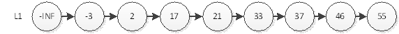
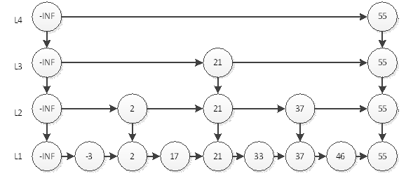
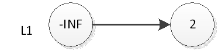
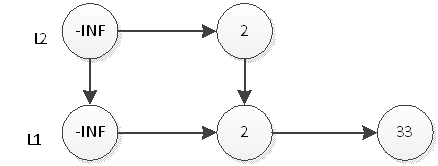
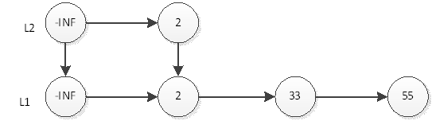
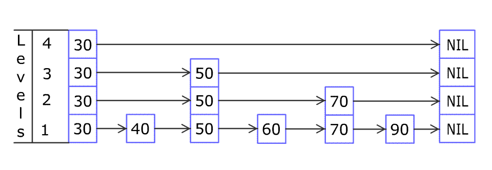

# 跳表

### 背景

​	跳表是一种链表，增加了跳跃功能，使得查找元素时，也能提供O(logN)的时间复杂度。

> 链表对给定位置(比如删除P指针指向的下一个节点)的插入删除操作是O(1)，而顺序表无论如何都是O(n)

### 跳跃表的引入

​ 我们知道，普通单链表查询一个元素的时间复杂度为O(n)，即使该单链表是有序的，我们也不能通过2分的方式缩减时间复杂度。

​	如上图，我们要查询元素为55的结点，必须从头结点，循环遍历到最后一个节点，不算-INF(负无穷)一共查询8次。那么用什么办法能够用更少的次数访问55呢？最直观的，当然是新开辟一条捷径去访问55。

​	如上图，我们要查询元素为55的结点，只需要在L2层查找4次即可。在这个结构中，查询结点为46的元素将耗费最多的查询次数5次。即先在L2查询46，查询4次后找到元素55，因为链表是有序的，46一定在55的左边，所以L2层没有元素46。然后我们退回到元素37，到它的下一层即L1层继续搜索46。非常幸运，我们只需要再查询1次就能找到46。这样一共耗费5次查询。

​	那么，如何才能更快的搜寻55呢？有了上面的经验，我们就很容易想到，再开辟一条捷径。

如上图，我们搜索55只需要2次查找即可。这个结构中，查询元素46仍然是最耗时的，需要查询5次。即首先在L3层查找2次，然后在L2层查找2次，最后在L1层查找1次，共5次。很显然，这种思想和2分非常相似，那么我们最后的结构图就应该如下图。

 

​	我们可以看到，最耗时的访问46需要6次查询。即L4访问55，L3访问21、55，L2访问37、55，L1访问46。我们直觉上认为，这样的结构会让查询有序链表的某个元素更快。那么究竟算法复杂度是多少呢？

​	如果有n个元素，因为是2分，所以层数就应该是log n层 (本文所有log都是以2为底)，再加上自身的1层。以上图为例，如果是4个元素，那么分层为L3和L4，再加上本身的L2，一共3层；如果是8个元素，那么就是3+1层。最耗时间的查询自然是访问所有层数，耗时logn+logn，即2logn。为什么是2倍的logn呢？我们以上图中的46为例，查询到46要访问所有的分层，每个分层都要访问2个元素，中间元素和最后一个元素。所以时间复杂度为O(logn)。

​	至此为止，我们引入了最理想的跳跃表，但是如果想要在上图中插入或者删除一个元素呢？比如我们要插入一个元素22、23、24……，自然在L1层，我们将这些元素插入在元素21后，那么L2层，L3层呢？我们是不是要考虑插入后怎样调整连接，才能维持这个理想的跳跃表结构。我们知道，平衡二叉树的调整是一件令人头痛的事情，左旋右旋左右旋……一般人还真记不住，而调整一个理想的跳跃表将是一个比调整平衡二叉树还复杂的操作。幸运的是，我们并不需要通过复杂的操作调整连接来维护这样完美的跳跃表。有一种基于概率统计的插入算法，也能得到时间复杂度为O(logn)的查询效率，这种跳跃表才是我们真正要实现的。

### 跳表的实现

​	容易实现的跳跃表，它允许简单的插入和删除元素，并提供O(logn)的查询时间复杂度。

​	先讨论插入，我们先看理想的跳跃表结构，L2层的元素个数是L1层元素个数的1/2，L3层的元素个数是L2层的元素个数的1/2，以此类推。从这里，我们可以想到，只要在插入时尽量保证上一层的元素个数是下一层元素的1/2，我们的跳跃表就能成为理想的跳跃表。那么怎么样才能在插入时保证上一层元素个数是下一层元素个数的1/2呢？很简单，抛硬币就能解决了！假设元素X要插入跳跃表，很显然，L1层肯定要插入X。那么L2层要不要插入X呢？我们希望上层元素个数是下层元素个数的1/2，所以我们有1/2的概率希望X插入L2层，那么抛一下硬币吧，正面就插入，反面就不插入。那么L3到底要不要插入X呢？相对于L2层，我们还是希望1/2的概率插入，那么继续抛硬币吧！以此类推，元素X插入第n层的概率是(1/2)的n次。这样，我们能在跳跃表中插入一个元素了。

​	在此还是以上图为例：跳跃表的初始状态如下图，表中没有一个元素：

​	

 

​	如果我们要插入元素2，首先是在底部插入元素2，如下图：

 

​	然后我们抛硬币，结果是正面，那么我们要将2插入到L2层，如下图

 

 

​	继续抛硬币，结果是反面，那么元素2的插入操作就停止了，插入后的表结构就是上图所示。接下来，我们插入元素33，跟元素2的插入一样，现在L1层插入33，如下图：

 

​	然后抛硬币，结果是反面，那么元素33的插入操作就结束了，插入后的表结构就是上图所示。接下来，我们插入元素55，首先在L1插入55，插入后如下图：

 

​	然后抛硬币，结果是正面，那么L2层需要插入55，如下图：

​	继续抛硬币，结果又是正面，那么L3层需要插入55，如下图：

​	

 

​	继续抛硬币，结果又是正面，那么要在L4插入55，结果如下图：

​	继续抛硬币，结果是反面，那么55的插入结束，表结构就如上图所示。

​	以此类推，我们插入剩余的元素。当然因为规模小，结果很可能不是一个理想的跳跃表。但是如果元素个数n的规模很大，学过概率论的同学都知道，最终的表结构肯定非常接近于理想跳跃表。 

​	再讨论删除，删除操作没什么讲的，直接删除元素，然后调整一下删除元素后的指针即可。跟普通的链表删除操作完全一样。

跳表动图：
 

​[关于时间复杂度的详细分析](https://blog.csdn.net/yaling521/article/details/78130271)
