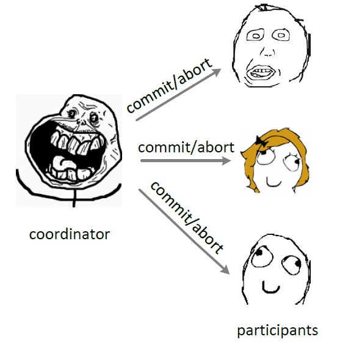

## 概要
> 主要讨论2阶段提交协议与3阶段提交协议，包括其定义及相应故障

## 2PC
------
### 引入
-----
&emsp;与单节点或本地事务不同，分布式事务往往由多个节点（机器）参与，同时事务所操作的数据往往也分布在不同的机器上，相同数据的多个副本也存储在不同的节点上。且分布式常常伴随着节点故障与网络分区问题，**这对于事务的原子性与一致性提出了较高的要求。**

> T（发起事务的节点）----T----> TM（主控节点）-----T-----> DM调度器（一个或多个数据相关节点）

⚠️：节点故障与通信通信故障导致两节点无法通信。超时机制下即使还没有到超时时间，节点也有可能认为它与另外一个节点无法通信（timeout failures），这常常是因为时钟不精确。

### 定义
------
&emsp;2PC是一种原子性提交协议（ACP），其包括投票阶段(1\2)与决定阶段(3\4)。
> 在没有故障发生的情况下，它的执行过程如下:
  1. 协调者发送一个VOTE-REQ消息给所有的参与者
  2. 当参与者接收到VOTE-REQ消息后，它会发送一个包含参与者投票结果的消息(YES或NO)给协调者作为响应。如果参与者投的是No，它会决定Abort事务并停止运行
  3. 协调者收集来自所有参与者的投票信息。如果所有的消息都是YES，同时协调者投的也是Yes，那么协调者就会决定进行Commit，并向所有参与者发送COMMIT消息。否则协调者就会决定进行Abort，并向所有投Yes的参与者发送ABORT消息(那些投No的参与者已经在第2步中决定Abort了)。之后，对于这两种情况协调者都会停止运行
  4. 每个投Yes的参与者等待来自协调者的COMMIT或ABORT消息。收到消息后执行相应动作然后停止运行。
  
  

⚠️：只要事务T在节点上满足Redo规则（由T写入的value都已经进入了可靠性存储中---数据库或日志），那么节点上的DM调度器就可以执行```commit(T)```。

### TM主控节点超时
------
&emsp;在2PC协议中只有主控节点知道所有的相关节点（参与者节点），相关节点相互之间是不知道的，那么有这样一种情况，主控节点如果超时，会造成相关节点单方面的阻塞。可以让协调者在发送VOTE-REQ消息时将参与者信息附加在上面，这里引入cooperative termination protocol。

**cooperative termination protocol**
> 参与者p如果在不确定区间（等待主控节点的结果消息）超时，它会发送一 个DECISION-REQ消息给所有其他进程，设为q，问下q是否知道决定结果或者能否单方面地做出决定。在这个场景中，p是initiator，q是responder。有如下三种情况:
 1. q已经决定进行Commit(或Abort):q简单地发送一个COMMIT(或ABORT)消息给p，然后p进行相应动作
 2. q还未进行投票:q可以单方面地决定进行Abort。然后它发送ABORT消息给p，p会因此决定进行ABORT
 3. q已经投了Yes但是还未做决定:q也是处于不确定状态，因此无法帮助p达成决定。

### 恢复
------
&emsp;相关节点（参与者）无法单方面恢复的情况往往是节点处在不确定区间时候down掉，因为这种情况下它自己不知道最终结果应该是commit还是abort，这种情况下可以使用**（cooperative）termination protocol**达成决定。

> 假设使用的是cooperative terminaion protocol，DT log的管理方式如下: 
  1. 当协调者发送VOTE-REQ消息时，它会在DT log中写入一条start-2PC记录。该记录包含了所有参与者的标识符，同时写入可以发生在发送消息之前或之后。
  2. 如果参与者投了Yes，它会在向协调者发送YES消息前向DT log中写入一条记录。该记录包含了协 调者名称及参与者列表(由协调者通过VOTE-REQ消息提供)。如果参与者投了No，它可以在向协调者 发送NO消息之前或之后写入一个abort记录。
  3. 在协调者向参与者发送COMMIT消息之前，它会向DT log中写入一条commit记录。
  4. 当协调者向参与者发送ABORT消息时，它会向DT log中写入一条abort记录。写入可以发生在发送 消息之前或之后。
  5. 在收到COMMIT(或ABORT)消息后，参与者向DT log中写入一条commit(或abort)记录。在上述讨论中，在DT log中写入一条commit(或abort)记录实际上就代表进程决定了是Commit还是 Abort。


## 3PC
------
### 引入
------
&emsp;在两阶段提交协议中（不考虑cooperative termination protocol的情况下），由于主控节点的down机会导致相关（参与）节点在不确定区间不必要的阻塞；参与节点在不确定区间down机导致的恢复问题。3PC加入超时机制，并在其中增加一个阶段，用于解决这样的问题。

### 定义
-------
&emsp;3PC包括canCommit、preCommit、doCommit三个阶段：
> canCommit

&emsp;3PC的CanCommit阶段其实和2PC的准备阶段很像。协调者向参与者发送commit请求，参与者如果可以提交就返回Yes响应，否则返回No响应。
  1.**事务询问** 协调者向参与者发送CanCommit请求。询问是否可以执行事务提交操作。然后开始等待参与者的响应。
  2.**响应反馈** 参与者接到CanCommit请求之后，正常情况下，如果其自身认为可以顺利执行事务，则返回Yes响应，并进入预备状态，否则反馈No。

> preCommit

&emsp;协调者根据参与者的反应情况来决定是否可以记性事务的PreCommit操作。根据响应情况，有以下两种可能。
  * 假如协调者从所有的参与者获得的反馈都是Yes响应，那么就会执行事务的预执行。
  1.**发送预提交请求** 协调者向参与者发送PreCommit请求，并进入Prepared阶段。
  2.**事务预提交** 参与者接收到PreCommit请求后，会执行事务操作，并将undo和redo信息记录到事务日志中。
  3.**响应反馈** 如果参与者成功的执行了事务操作，则返回ACK响应，同时开始等待最终指令。

  * 假如有任何一个参与者向协调者发送了No响应，或者等待超时之后，协调者都没有接到参与者的响应，那么就执行事务的中断。
  1.**发送中断请求** 协调者向所有参与者发送abort请求。
  2.**中断事务** 参与者收到来自协调者的abort请求之后（或超时之后，仍未收到协调者的请求），执行事务的中断。

> doCommit

&emsp;该阶段进行真正的事务提交，分为两种情况：
* 执行提交
  1.**发送提交请求** 协调接收到参与者发送的ACK响应，那么他将从预提交状态进入到提交状态。并向所有参与者发送doCommit请求。
  2.**事务提交** 参与者接收到doCommit请求之后，执行正式的事务提交。并在完成事务提交之后释放所有事务资源。
  3.**响应反馈** 事务提交完之后，向协调者发送Ack响应。
  4.**完成事务** 协调者接收到所有参与者的ack响应之后，完成事务。

* 中断事务
  协调者没有接收到参与者发送的ACK响应（可能是接受者发送的不是ACK响应，也可能响应超时），那么就会执行中断事务。
  1.**发送中断请求** 协调者向所有参与者发送abort请求
  2.**事务回滚** 参与者接收到abort请求之后，利用其在阶段二记录的undo信息来执行事务的回滚操作，并在完成回滚之后释放所有的事务资源。
  3.**反馈结果** 参与者完成事务回滚之后，向协调者发送ACK消息。
  4.**中断事务** 协调者接收到参与者反馈的ACK消息之后，执行事务的中断。

⚠️：在doCommit阶段发生down机

* 主控节点down机
  这种情况下，如果参与节点等待主控节点超时，参与节点可以自己执行commit，因为如果能够到达doCommit阶段，说明在canCommit阶段中所有节点都提交的是YES。

* 参与节点down机
  这种情况下，在参与节点恢复之后可以根据自身的redo进行恢复，因为redo日志在preCommit阶段写到持久化设备中，而到达preCommit阶段可以说明所有的参与节点都提交了YES。

* ⚠️当然在doCommit阶段如果主控节点发送的是Abort消息，而此时有参与节点down机，那么当该节点修复之后将会执行redo操作造成数据的不一致。

