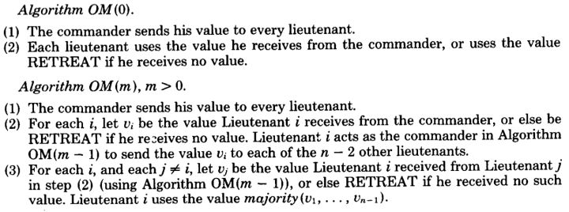
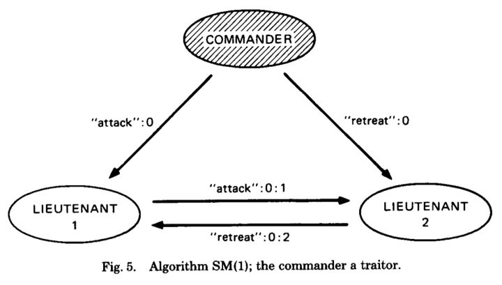

# 拜占庭将军问题

~~ps：这边要补充的内容包括：一些实例的图，何东升讲证明的时候的图，还有拜占庭的论文描述，以及签名算法的补充，还有目前区块链的POW引申~~

> **拜占庭将军问题是一个共识问题: 首先由LeslieLamport与另外两人在1982年提出，被称为The Byzantine Generals Problem或者Byzantine Failure。核心描述是军中可能有叛徒，却要保证进攻一致，由此引申到计算领域，发展成了一种容错理论。**

### 一个非正式的问题描述

拜占庭帝国想要进攻一个强大的敌人，为此派出了10支军队去包围这个敌人。这个敌人虽不比拜占庭帝国，但也足以抵御5支常规拜占庭军队的同时袭击。基于一些原因，这10支军队不能集合在一起单点突破，必须在分开的包围状态下同时攻击。他们任一支军队单独进攻都毫无胜算，除非有至少6支军队同时袭击才能攻下敌国。他们分散在敌国的四周，依靠通信兵相互通信来协商进攻意向及进攻时间。困扰这些将军的问题是，他们不确定他们中是否有叛徒，叛徒可能擅自变更进攻意向或者进攻时间。在这种状态下，拜占庭将军们能否找到一种分布式的协议来让他们能够远程协商，从而赢取战斗？这就是著名的拜占庭将军问题。（其中不会去考虑通信兵是否会被截获或者无法传达信息等问题，即信道没有问题。有一个相似问题叫两军问题）

### 口头版算法（口头协议）

假设在一个有n个将军和m个叛徒的团队中，只要满足n>=3m+1,此问题在口头协议算法下有解。

其中：

1. 下文采用将军——副官模型（Lamport原文也是采用该模型）会将团队的n个人分为1个将军和n-1个副官进行说明。实际上只需把将军——副官模型遍历至所有的将军即可； 
2. m个叛徒中可以包含1个将军和m-1个副官，也可以是m个副官；

①OM（0）算法：

- 将军把他的命令发给每个副官；
- 每个副官执行将军的命令，若未收到命令，则执行默认命令；

②OM（m）算法：

- 将军把他的命令发给每个副官； 
- 对于任意i<=n，Vi是副官i从将军处收到的命令，副官i在OM（m-1）中作为将军把Vi发送给除     将军和副官i以外的n-2个副官； 
- 对于任意j≠i，Vj是副官i在第2步中从副官j用OM（m-1）算法时收到的命令，最终副官i使用majority（V1，V2......Vn-1）算出副官i最终执行的命令。

其中majority（V1，V2......Vn-1）= Vk ，其中Vk的值的出现次数最多，即副官执行大多数人会执行的命令，否则执行默认命令。 注意Vk的值具有唯一性。比如V1至Vn-1中出现了5个A和4个R，其余值出现次数均小于5，则majority（V1,，V2......Vn-1）=A。但若出现了5个A和5个R，其余值出现次数均小于5，则majority（V1,，V2......Vn-1）=O，其中O则为默认命令。

算法采用了递归思想。然而不得不承认，老师在讲递归时，我是睡过去的...因为完全无法理解...下面将举一个例子来说明这个算法： 假设n=7，m=2。即团队中有1个将军（记为X），6个副官（记为A~F），其中有2个叛徒。（其中假设副官A是忠诚的）根据算法进行演绎：

1.X向A~F发送指令，假设A收到的指令值为V1，B收到的为V2......F收到的指令为V6，其中V1到V6的值可以完全相同（将军是忠诚的），也可以不全相同（将军是叛徒）；

2.副官A向副官B~F发送指令V1，副官B~F同时也会向除X和自身以外的其他5个人发送自己从将军处收到的指令；

3.根据第2步，A会从B~F处各收到一条指令，分别记为a2~a6。由于B~F中有1到2个叛徒，A不能将a2~a6分别视作V2~V6，而应该分别确认a2~a6的真实性。以从B收到的a2为例，A应当向C~F发送a2信息，并且应当从C~F收到B在第2步中发给他们的信息，假设为b3~b6；

4.A可以使用majority函数算出V2=majority（a2，b3，b4，b5，b6）。副官A对于V3~V6同理进行操作。（按照算法说明，对于V3~V6的信息收集应该在第3步就完成了，第4步应该只用majority函数即可）；

5.A再使用一次majority函数算出自己应当执行的命令，即为majority（V1，V2......V6）。其中V1为第1步中X发给A的指令，V2~V6是A在第4步中通过majority函数算出来的指令；

副官B~F和A同时按照上述1至5步进行操作。一次将军——副官模型的OM（2）计算就完成了。

问题：为什么A收到a2和a6后不能直接视作V2和V6？ 答：因为在有2个叛徒的情形下，V1，a2~a6的值肯定不会完全相同。可能存在V1=V2=V3=V4≠V5≠V6。 情形1：将军是忠诚的，副官E、F是叛徒； 情形2：将军和副官E（或F）是叛徒:； 上述两种情形均会导致V1=V2=V3=V4≠V5≠V6。而根据拜占庭将军问题描述： 一致性：所有忠诚的副官必须遵守同一命令； 正确性：如果将军是忠诚的，则每个忠诚的副官必须遵守将军的命令； 换而言之，如果将军是不忠诚的时候，则忠诚的副官只要遵守同一命令（即满足正确性），而不需遵守将军的命令（也无法遵守将军的命令）； 于是副官A不知道将军是否忠诚，因此就不知道是否需要遵守将军的命令。

总结：

1.在将军——副官模型中，有1个将军，超过3m个副官和m个叛徒的情况下，每个副官均应使用m层majority函数，而对于任意k<=m时，该副官在第k层应使用P（m-k,n-2）次majority函数，因此对于一次将军——副官模型中，该副官总共要用

次majority函数； 2.该算法是一个关于m的XX算法（阶乘和指数的算法...），使用该算法的前提是知道m的值，并且要求n>=3m+1,即要求四模冗余。

### 口头版算法证明

命题：证明OM(m)算法在n>3m（等价于n>=3m+1）时成立。

回顾口头算法中的两个约束条件：

IC1：所有忠诚的副官都要遵守同一个命令，即一致性；

IC2：如果将军是忠诚的，则每一个忠诚的副官都应该遵守将军的命令；

在此先引入一个引理LEMMA1：对于任意非负整数m和k，当n>2k+m且最多有k个叛徒，那么算法OM（m）满足IC2。该引理数学证明如下：

（1）当k=0时，若将军是忠诚的，根据算法OM（0）可知忠臣会直接遵守将军发来的命令，而根据IC2的假设，将军是忠诚的，因此所有忠臣接收到的命令都是同一个值。因此当k=0时可以OM（k）算法可以满足IC2；

（2）当k>=1时，由于n>2k+m，在OM（k）到OM（k-1）时，由于减少的是忠诚的将军，因此整个算法总人数为n-1，而叛徒数仍然为k。由于n>2k+m，故n-1>2k+m-1>=2k，即n-1>2k。即在OM（m-1）算法中，忠臣的个数（n-1-k）是大于叛徒的个数（k）。由于OM（k-1）成立，因此根据majority函数投票，在将军是忠诚的情况下，如果忠臣的个数大于叛徒的个数时，所有忠臣均会执行将军的指令（如果不理解的话可以令k=1，m=1推演一遍）

接着证明原命题OM（m）算法在n>3m时成立：

（1）首先假设将军是忠诚的，那么将LEMMA1中的k换成m，则OM（m）满足IC2，由于将军是忠诚的，所有忠诚的副官都会执行将军的命令，自然也就满足IC1；

（2）如果将军是叛徒，则不用考虑IC2是否满足，只需证明IC1即可。

参考LEMMA1的证明，若将军是叛徒，则从OM（m）到OM（m-1）时，由于减少的将军是叛徒，因此整个算法的总人数为n-1，且叛徒个数也为m-1，忠臣的个数n-m+1，由于n>3m，因此忠臣个数n-m+1>2m+1>m-1，即到OM（m-1）时忠臣是能够达成一致的。而在OM（m-1）到OM（m-2）的情况下，除了要发送指令的将军'，即上述案例中所述的副官A以外，还有超过3m-1个，而3m-1>3（m-1），因此在OM（m-1）的情况下，也能够满足原命题条件。

### 签名算法（SM，书面协议）

初始化，Vi=空集

1. 发令者签名，然后将他的消息发送给每个下属

2. 对于任意的i：

3. 1. 如果下属i从发令者处收到了一个形如v:0的消息，同时目前为止他还未收到任何其他命令，那么：

   2. 1. 下属i让Vi={v}.
      2. 下属i向其他下属发送消息v:0:i.

   3. 如果下属i收到过形如v:0:j1:…:jk的消息，同时v还未出现在集合Vi中，那么：

   4. 1. 将v添加到Vi
      2. 如果k<m,那么他就向除j1:…:jk之外的其他下属发送消息v:0:j1:…:jk:i

4. 对于任意的i：当下属i不再收到任何消息时，他选择choice(Vi)的值作为命令

上图代表了当有三个将军且发令者是叛徒的时候，算法SM(1)的执行情况。发令者给其中一个下属发送进攻命令，给另一个发送撤退命令。在步骤(2)，两个下属都收到了这两个命令，因此步骤(2)之后，V1=V2={attack,retreat}，这样他们会得到相同的choice({attack,retreat})值。并且他们都猜到发令者是叛徒。

### **工作量证明Pow**实现拜占庭共识

现在我们看一下比特币的工作量证明是如何解决计算机网络中的拜占庭将军问题的。比特币网络是就交易的顺序，没有中心化机构的情况下达成共识的，同样拜占庭将军也是做得同样的事情。拜占庭将军需要攻击城堡，所有将军需要对任何将军可能提出的攻击时间达成共识。

方案一：被所有将军都接受到的攻击计划，被认为是正式的攻击计划。问题是：两个或多个将军有可能同时发出不同的攻击计划。

**这个问题模型被工作量证明简化了，比特币工作量证明系统中，不会追踪交易顺序，取而代之是在将军之间达成共识。**每个将军基于工作量证明，解决一个难度适当的Hash难题，每个难题有足够的难度，仅当在所有的将军同时工作时，平均10Mins会找到一个难题的答案（solution）。当一个将军找到问题的答案，它会把这个答案连同攻击计划在网络中广播。一旦收到Solution，每个将军调整难题为在广播中收到的攻击时间，攻击计划。然后将军继续解决下一个工作量证明。这样接下来每个solution会依次在第一个solution后串联成链。如果有将军还在继续在对另一个不同的攻击方案进行工作量证明计算，它会切换到这个最长的链上。这个最长链上积累了最多的CPU算力。

平均一个小时后，这个链上会有六个区块。每个将军可以判断是否有足够多的将军工作在含有相同初始攻击计划的最长链上。链会在一小时累积到六个区块，说明大多数将军对相同的攻击计划进行工作量证明计算（CPU投票）。因此将军对攻击时间达成共识。

