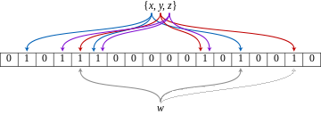
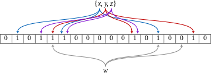
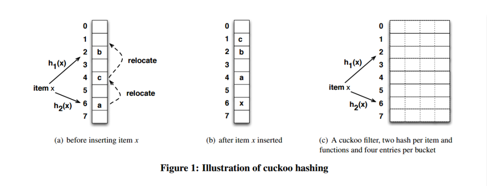

---

---

# Bloom Filter 与 Cuckoo Filter

> 索引的存储分为有序和无序，前者使用关联式容器，比如B树；后者使用哈希算法。关联式容器时间复杂度稳定为O(logN)，且支持范围查询。而哈希算法的查询，增删都比较快，为O(1)，但是在碰撞严重的情况下，哈希算法的时间复杂度会退化到O(n)，而Bloom Filter 和 Cuckoo Filter 都是哈希索引结构。

## Bloom Filter

### 背景

​	日常生活中，包括在设计计算机软件时，我们经常要**判断一个元素是否在一个集合中**。最直接的方法就是将集合中全部的元素存在计算机中，遇到一个新元素时，将它和集合中的元素直接比较即可。

​	一般来讲，**计算机中的集合是用哈希表（hash table）来存储的**。它的好处是快速准确，缺点是费存储空间。当集合比较小时，这个问题不显著，但是当集合巨大时，哈希表存储效率低的问题就显现出来了。列如：在如果用哈希表，每存储一亿个 email 地址， 就需要 1.6GB 的内存（用哈希表实现的具体办法是将每一个 email 地址对应成一个八字节的信息指纹,然后将这些信息指纹存入哈希表，由于哈希表的存储效率一般只有 50%，因此一个 email 地址需要占用十六个字节。一亿个地址大约要 1.6GB， 即十六亿字节的内存）。因此存贮几十亿个邮件地址可能需要上百 GB 的内存。除非是超级计算机，一般服务器是无法存储的。

​	而布隆过滤器只需要哈希表 1/8 到 1/4 的大小就能解决同样的问题。布隆过滤器是由巴顿.布隆于一九七零年提出的。它实际上是一个**很长的二进制向量和一系列随机映射函数**。

#### 介绍

1. 原理：当一个元素被加入集合时，通过K个Hash函数将这些元素映射成一个位图阵列(位图)中的K个点，把它们置为1。当检索时，只需要看看这K个点是不是都是1就**大约**知道集合中有没有这个检索的元素。如果这些点有任何一个0，那么被检索元素**一定不在**，如果都是1，**可能**在。

2. 优点: 

   1) 不需要存储key，节省空间；

   2) 布隆过滤器存储空间和插入 / 查询时间都是常数O(k)；

3. 缺陷:

   ​	1）不能删除。

   ​	2）存在误判率。在判断一个元素是否属于某个集合时，有可能把不属于这个集合的元素误认为会属于这个集合，因此布隆过滤器在能容忍低错误率的应用场合下，通过极少的错误来换取存储空间的极大节省。如下图，x、y、z通过3个哈希函数映射的结果，当需要检测w是否存在时，同样将w通过3个哈希函数映射出三个位置，发现全都置为1了，得出结论w是存在的。但其实不然，只是恰好w映射的位置结果已经全被占用了，此时即出现误判。

#### 构建流程

- 首先初始状态下，初始一个包含m位的的位数组，每一位都置为0

- 为了表达一个S={x1,x2,...,xn}这样一个n个元素的数组，使用k个Hash函数，将它们分别映射到[1,m]的范围中，对于任意一个元素x，第i个哈希函数映射的位置hi(x)会被置为1.如果一个位置多次被置为1，那么只有第一次会起作用

- 在判断y是否属于集合S时，对y使用k次哈希函数，如果所有的hi(y)的位置都是1，那么就认为y是集合中的元素，否则就认为y不是集合中的元素

  如下图，x、y、z通过3个哈希函数映射到对应位置置1，当需要检测w是否存在时，同样将w通过3个哈希函数映射出三个位置，3个位置全部置1则判断w可能存在；若不全为1，则w一定不存在，本例子中w即不存在。

#### 错误率

​	当集合S={x1,x2,...,xn}的所有元素都被k个哈希函数映射到m位的位数组中时，这个位数组中某一位还是0的概率是：

> 其中`1/m`表示任意一个哈希函数选中这一位标1的概率，用`1`减去`1/m`即是哈希一次都没有被选中这一位的概率，然后把S映射到位数组中，需要做kn次哈希，即可写出上面的公式，这里使用到近似公式
>
> 

​	同理，位数组任意一位为1的概率约为1-e^(-kn/m)，而(1-e^(-kn/m))^k其实就是所谓的false positive rate，即k次哈希都刚好选中1的区域。

#### 最优哈希函数个数

​	怎么确定几个哈希函数能让元素查询时的错误率降到最低？有两个方面来思考

- 如果哈希函数个数多，那么对于一个不属于集合的元素进行查询时得到0的概率就小
- 如果哈希函数个数少，那么位数组中的0就多

设错误率为f，由前面已知错误率f = (1-e^(-kn/m))=e^(kln(1-e^(-kn/m))，令g = kln(1-e^(-kn/m)，则g为最小，错误率也取到最小。由于p = e^(-kn/m)，则

通过对称性法则，可知当p = 1/2时即是k = ln2*(m/n)时，取得最小值。也就是说，要想保持错误率低，最好让位数组有一半还空着。最小的错误率为lnf = (-m/n)*(ln2)^2

而对于位数组的大小，经过推导，在错误率不大于x的情况下，m至少要等于`nlog2(1/x)`才能表示任意n个元素的集合。并且在哈希函数的个数取到最优时，要让错误率不超过x，m至少需要取到最小值的1.44倍。

#### 拓展

​	因为前面提到过`如果一个位置多次被置为1，那么只有第一次会起作用`，所以不支持删除一个已经插入的关键字，会牵动到其他的关键字。可以通过`counting bloom filter`，用一个counter数组代替位数组就可以支持删除了，但是这样又会使每个bit空间扩张成一个计数值，空间效率又降低了。

#### 应用场景

（1）拼写检查，即判断一个单词是否存在字典。

（2）垃圾邮件过滤

​      假设邮件服务器通过发送方的邮件域或者IP地址对垃圾邮件进行过滤，那么就需要判断当前的邮件域或者IP地址是否处于黑名单之中。如果邮件服务器的通信邮件数量非常大（也可以认为数据量级上亿），那么也可以使用Bloom Filter算法。

（3）加快数据库查询过程

​      Google 著名的分布式数据库 Bigtable 使用了布隆过滤器来查找不存在的行或列，以减少磁盘查找的IO次数。

​      在很多Key-Value系统中也使用了布隆过滤器来加快查询过程，如 Hbase，Accumulo，Leveldb，一般而言，Value 保存在磁盘中，访问磁盘需要花费大量时间，然而使用布隆过滤器可以快速判断某个Key对应的Value是否存在，因此可以避免很多不必要的磁盘IO操作，只是引入布隆过滤器会带来一定的内存消耗。

（4）LevelDB增加查询效率

​	LevelDB利用布隆过滤器判断指定的key是否存在于sstable中，若过滤器表示不存在，则该key一定不存在。

## Cuckoo Filter

### 背景

​	为了解决布隆过滤器中不能删除，且存在误判的缺点，本文引入了一种新的哈希算法——cuckoo filter，它既可以**确保该元素存在的必然性**，又可以在不违背此前提下**删除任意元素**，仅仅比bitmap**牺牲了微量空间效率**。

### Cuckoo hashing

​	需要先理解cuckoo hashing

​	Cuckoo的哈希函数是成对的（具体的实现可以根据需求设计），每一个元素都是两个，分别映射到两个位置，一个是记录的位置，另一个是备用位置，这个备用位置是处理碰撞时用的。

如下图，使用hashA 和hashB 计算对应key x的位置a和b ：

1. 当两个哈希位置有一个为空时，则插入该空位置；
2. 当两个哈希位置均不为空时，随机选择两者之一的位置上key y 踢出，并计算踢出的key y在另一个哈希值对应的位置，若为空直接插入，不为空踢出原元素插入，再对被踢出的元素重新计算，重复该过程，直到有空位置为止。直到被踢的次数达到一个上限，才确认哈希表已满，并执行rehash操作。

#### Cuckoo Filter介绍

下面介绍 cuckoo filter。相对的cuckoo hashing，cuckoo filter里不会存储原信息， 只存储指纹信息

1. 算法特点：因为在插入过程中可能因为反复踢出无限循环下去，这时就需要进行一次循环踢出的限制，超出限制则认为过滤器容量不足，需要进行扩容。另外布谷鸟过滤器在bucket上存储的是key的`指纹`，主要是考虑到不同的key长度不定，节约空间。`fingerprint` 一般由key做hash得来，长度较短，一般为8-12bit，也可根据实际数据量调整。

2. 寻找第二个bucket的方法：由于计算key的存储位置使用的时key本身的值，而存储时仅存储了fingerprint，因此当key被挤出，需要重新找位置时，通过指纹信息来找到第二个bucket

   

   通过异或来实现，所以

   

   cuckoo filter采用只需要指纹信息就能找到第二个位置的方式， 技巧在这里：

   1. ​    loc1= HASH(key)
   2. ​    loc2= loc1 ⊕HASH(key′s fingerprint)

   其中 ⊕ 是异或运算

   也就是说， 知道了当前的loc1， 知道指纹信息， 就可以计算出另外一个loc2。

   > loc1做异或运算可以得到loc2，那么假如被踢出来的key已经是loc2了，其做异或运算会得到loc1还是其他位置呢？
   >
   > **答案是loc1，**原因在于异或运算的性质。**存在性质：b^a^a=b**。
   >
   > 因此当loc2做异或=loc1^HASH(key′s fingerprint)^HASH(key′s fingerprint)=loc1.
   >
   > 由此，踢出来的loc做异或运算，总能找到另外一个位置。

   ### 改进

   ​	一个改进的哈希表如下图所示，每个桶（bucket）有4路槽位（slot）。当哈希函数映射到同一个bucket中，在其它三路slot未被填满之前，是不会有元素被踢的，这大大缓冲了碰撞的几率。笔者自己的简单实现上测过，采用二维哈希表（4路slot）大约80%的占用率（CMU论文数据据说达到90%以上，应该是扩大了slot关联数目所致）。

   

