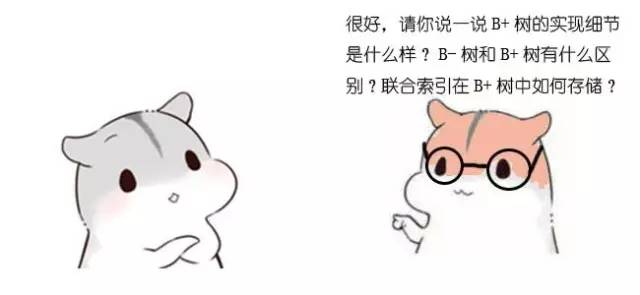

# 漫画算法：什么是 B 树？

> 本文转载自[伯乐在线-漫画算法：什么是 B 树？](http://blog.jobbole.com/111757/?utm_source=blog.jobbole.com&utm_medium=relatedPosts)

本文提到的「B-树」，就是「B树」，都是 B-tree 的翻译，里面不是减号-，是连接符-。因为有人把 B-tree 翻成 「B-树」，让人以为「B树」和「B-树」是两种树，实际上两者就是同一种树。

------

------

------

**二叉查找树的结构**

**第1次磁盘IO**

**第2次磁盘IO：**

**第3次磁盘IO：**

**第4次磁盘IO：**

**下面来具体介绍一下B-树（Balance Tree），一个m阶的B树具有如下几个特征：**

1.根结点至少有两个子女。

2.每个中间节点都包含k-1个元素和k个孩子，其中 m/2 <= k <= m

3.每一个叶子节点都包含k-1个元素，其中 m/2 <= k <= m

4.所有的叶子结点都位于同一层。

5.每个节点中的元素从小到大排列，节点当中k-1个元素正好是k个孩子包含的元素的值域分划。

**第1次磁盘IO：**

**在内存中定位（和9比较）：**

**第2次磁盘IO：**

**在内存中定位（和2，6比较）：**

**第3次磁盘IO：**

**在内存中定位（和3，5比较）：**

自顶向下查找4的节点位置，发现4应当插入到节点元素3，5之间。

节点3，5已经是两元素节点，无法再增加。父亲节点 2， 6 也是两元素节点，也无法再增加。根节点9是单元素节点，可以升级为两元素节点。于是**拆分**节点3，5与节点2，6，让根节点9升级为两元素节点4，9。节点6独立为根节点的第二个孩子。

自顶向下查找元素11的节点位置。

删除11后，节点12只有一个孩子，不符合B树规范。因此找出12,13,15三个节点的中位数13，取代节点12，而节点12自身下移成为第一个孩子。（这个过程称为**左旋**）

------

引用：
[1] [漫画算法：什么是B 树？ - 文章- 伯乐在线](http://blog.jobbole.com/111757/?utm_source=blog.jobbole.com&utm_medium=relatedPosts) 
[2] [图片来自：漫画算法：什么是 B+ 树？ -简书](https://www.jianshu.com/p/1f2560f0e87f)