# 一致性哈希算法（consistent hashing）
对于分布式存储，不同机器上存储不同对象的数据，我们使用哈希函数建立从数据到服务器之间的映射关系。
## 一、使用简单的哈希函数
`m = hash(o) mod n`
- 其中，o为对象名称，n为机器的数量，m为机器编号。

考虑以下例子：

3个机器节点，10个数据 的哈希值分别为1,2,3,4,…,10。使用的哈希函数为：(`m=hash(o) mod 3`)
机器0 上保存的数据有：3，6，9
机器1 上保存的数据有：1，4，7，10
机器2 上保存的数据有：2，5，8

当增加一台机器后，此时n = 4，各个机器上存储的数据分别为：
    
    机器0 上保存的数据有：4，8
    机器1 上保存的数据有：1，5，9
    机器2 上保存的数据有：2，6，10
    机器3 上保存的数据有：3，7
只有数据1和数据2没有移动，所以当集群中数据量很大时，采用一般的哈希函数，在节点数量动态变化的情况下会造成大量的数据迁移，导致网络通信压力的剧增，严重情况，还可能导致数据库宕机。
## 二、一致性哈希
一致性hash算法正是为了解决此类问题的方法，它可以保证当机器增加或者减少时，节点之间的数据迁移只限于两个节点之间，不会造成全局的网络问题。
### 1. 环形Hash空间
按照常用的hash算法来将对应的key哈希到一个具有2^32次方个桶的空间中，即0~(2^32)-1的数字空间中。现在我们可以将这些数字头尾相连，想象成一个闭合的环形。如下图：

### 2. 将数据通过hash算法映射到环上
将object1、object2、object3、object4四个对象通过特定的Hash函数计算出对应的key值，然后散列到Hash环上。如下图：
    Hash(object1) = key1； 
    Hash(object2) = key2；
    Hash(object3) = key3；
    Hash(object4) = key4；      
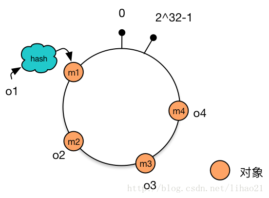
### 3. 将机器通过hash算法映射到环上
假设现在有NODE1，NODE2，NODE3三台机器，通过Hash算法（*机器IP或机器的唯一的名称作为输入*）得到对应的KEY值，映射到环中，其示意图如下：
    Hash(NODE1) = KEY1;
    Hash(NODE2) = KEY2;
    Hash(NODE3) = KEY3;
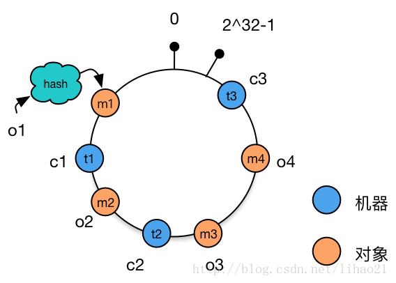
### 4. 将数据存储到机器上
通过上图可以看出对象与机器处于同一哈希空间中，这样按顺时针转动object1存储到了NODE1中，object3存储到了NODE2中，object2、object4存储到了NODE3中。

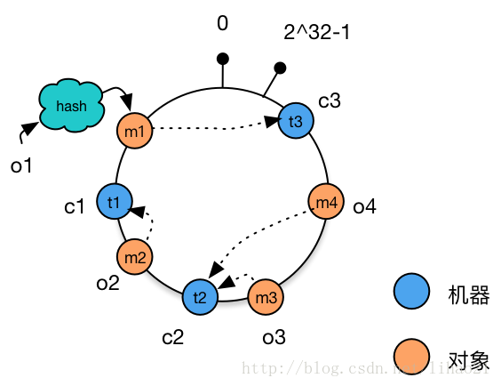

### 5. 机器的添加与删除
1. 向集群中添加一台新机器
    向集群中增加机器c4，c4经过hash函数后映射到机器c2和c3之间。这时根据顺时针存储的规则，数据m4从机器c2迁移到机器c4。数据的移动仅发生在c2和c4之间，其他机器上的数据并未受到影响。
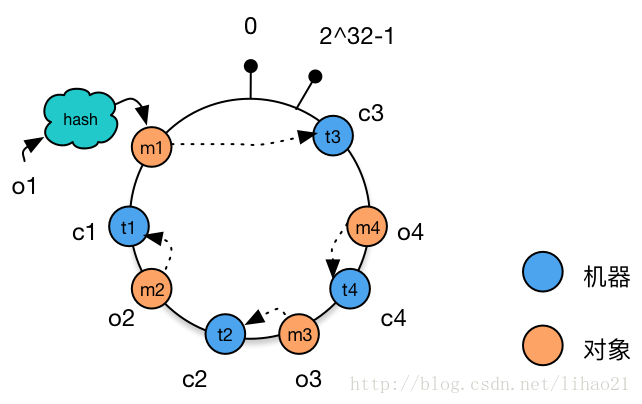
1. 从集群中删除一台机器
    从集群中删除机器c1，这时只有c1原有的数据需要迁移到机器c3，其他数据并未受到影响。
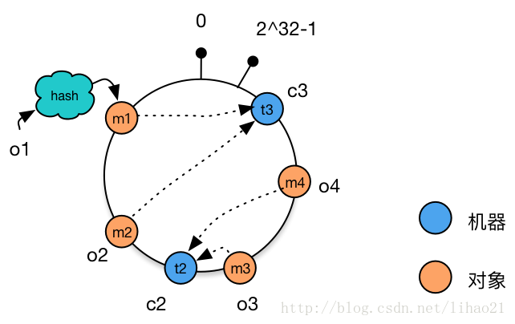

- 相比于之前的简单取模方法中动态增删集群中机器的数量时，造成全局的数据迁移，使用一致性哈希算法将大大改善这种情况，减轻了网络通信的压力。
### 存在的问题：
当集群中的节点数量较少时，可能会出现节点在哈希空间中分布不平衡的问题。如下图所示，图中节点A、B、C分布较为集中，造成**hash环的倾斜**。数据1、2、3、4、6全部被存储到了节点A上，节点B上只存储了数据5，而节点C上什么数据都没有存储。**A、B、C三台机器的负载极其不均衡**。
   

在极端情况下，假如A节点出现故障，存储在A上的数据要全部转移到B上，大量的数据导可能会导致节点B的崩溃，之后A和B上所有的数据向节点C迁移，导致节点C也崩溃，由此导致整个集群宕机。这种情况被称为**雪崩效应**。

### 解决方法——虚拟节点

解决哈希环偏斜问题的方法就是，让集群中的节点尽可能的多，从而让各个节点均匀的分布在哈希空间中。在现实情境下，机器的数量一般都是固定的，所以我们只能将现有的物理节通过虚拟的方法复制多个出来，这些由实际节点虚拟复制而来的节点被称为**虚拟节点**。加入虚拟节点后的情况如下图所示：

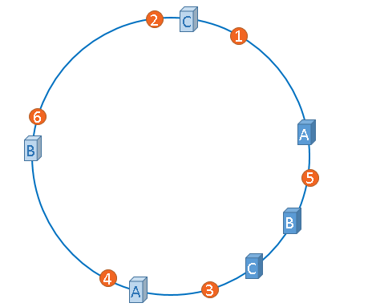

从上图可得：加入虚拟节点后，节点A存储数据1、3；节点B存储5、4；节点C存储2、6。节点的负载很均衡。

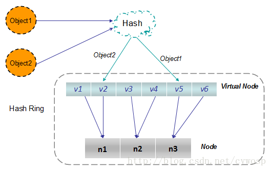

---
# Chord 环
在分布式集群中，经常要寻找指定数据存储的物理节点，关于这个问题有三种比较典型的方法来解决。

## 三种典型的解决方案：
### 1. Napster：
- 使用一个中心服务器接收所有的查询，中心服务器返回数据存储的节点位置信息。
- **存在的问题**：中心服务器单点失效导致整个网络瘫痪。

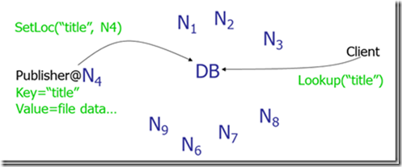
### 2. Gnutella：
- 使用消息洪泛（message flooding）来定位数据。一个消息被发到系统内每一个节点，直到找到其需要的数据为止。使用生存时间（TTL）来限制网络内转发消息的数量。
- **存在的问题**：消息数与节点数成线性关系，导致网络负载较重。
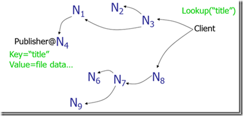
### 3. SN型：
- 现在大多数采用所谓超级节点（Super Node），SN保存网络中节点的索引信息，这一点和中心服务器类型一样，但是网内有多个SN，其索引信息会在这些SN中进行传播，所以整个系统的崩溃几率就会小很多。尽管如此，网络还是有崩溃的可能。

## 分布式散列表——Chord算法

### 一、Chord实现原理
- Chord算法是一致性哈希算法的一种实现方式，数据和机器的组织方式同上节所讲,在Chord中使用SHA-1算法所谓其哈希函数，每一项为160bit的大整数，哈希空间的大小为2^160，下图为Chord简化后(6bit的哈希值)的示意图：
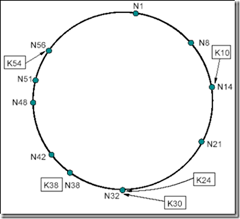
### 二、Chord资源定位：
资源定位是Chord协议的**核心功能**，我们首先从一个简单的定位方法讲起：
#### 顺序查找：
每个节点都只保存其后继节点信息，当发起查询时，节点首先在本地查找，如果没有则询问其后继节点，如果资源k的哈希值位于本节点和下一节点之间，则说明k存储在其后继节点上；如果不在，则下一个节点向其后继节点发起同样的查询，直到找到 `hash(node) > hash(k)`。

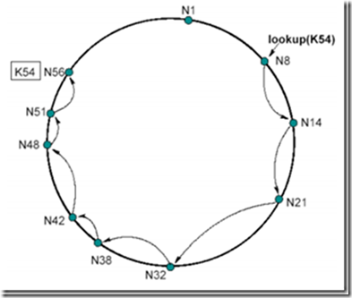

节点N8查找资源K54，N8的后继节点N14不合符54є (8; 14]，于是N14向其后继节点N21发起同样的查询，依次类推，直到节点N56满足54є (51; 56]，于是得知资源K54在N56这个节点上。

- 存在的问题：查找次数与节点个数成线性关系，时间复杂度是O(N)，对一个上百万节点，且节点经常加入、退出的P2P网络来说，O(N)是不可忍受的，因此Chord提出了下面非线性查找的算法。

#### 使用路由表提高效率
在每个节点N上都维护了最多有m项（m为哈希结果的位数）的路由表（*finger table*），用来定位资源。这个表的第i项是`hash(node)+2^(i-1)`处所属节点的位置。如下图所示(m=6)：

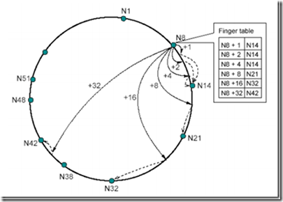

节点N8的路由表中，左边一列包含了N8+1到N8+32（2^5-1）的位置，右边一列对应其所属节点的信息。比如N8+1-N14，表示在N8后的第一个位置上的资源由N14来负责。这样记录有以下优势：
1. 每个节点只包含全网中一小部分节点的信息。
2. 每个节点对于临近节点负责的位置知道的更多，比如N8节点对于N14负责的位置知道3处，而对N21负责的位置只知道1处。
3. 路由表通常不包含直接找到后继节点的信息，往往需要询问其他节点来完成。
### 三、查询步骤
当在某个节点上查找资源时，首先判断**其后继节点**有没有持有该资源，若没有则直接从该节点的路由表**从最远处开始查找**。直到找到第一个hash(node)小于hash(data)的节点，然后跳转到此节点上，进行新一轮的查找。当hash(data)落在此节点和其后继节点之间时，则说明资源存储在当前节点的后继节点上。

例如：节点N8寻找K54这个资源

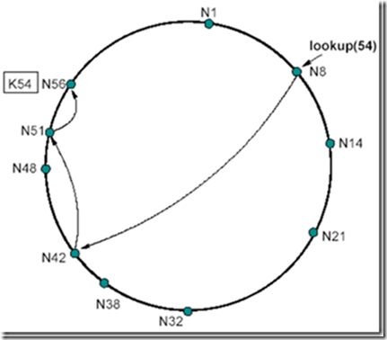

首先，在N8上查找后继节点为N14，发现K54并不符合54є (8; 14]的要求，那么直接在N8的路由表上查找符合这个要求的表项（由远及近查找），此时N8的路由表为：

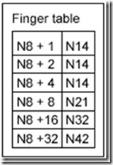

我们发现路由表中最远的一项N8+32--N42满足42є (8; 54]，那么跳到N42这个节点上继续查找。N42的后继节点为N48，不符合54є (42; 48]的要求，说明N48不持有资源54，此时，开始在N42的路由表上查找：

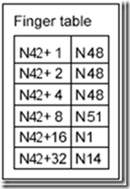

我们由远及近开始查找，发现N42+8--N51满足51є (42; 54]，则说明N51这个点离持有K54这个资源的节点最近，那么此时跳到N51这个节点上继续查找。N51节点的后继节点为N56，符合54є (51; 56]，此时定位完成，N56持有资源节点K54。

### 四、路由表的维护
#### 添加节点
Chord通过在每个节点的后台周期性的进行询问后继节点的前驱节点是不是自己来更新后继节点以及路由表中的项。例如向以下chord环中添加节点：

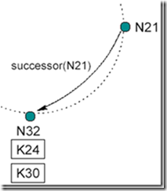

现在N26节点要加入系统，首先它将自己的后继节点修改为N32，之后N26通知N32，N32接到通知后将自己前驱节点修改为N26。如下图所示：

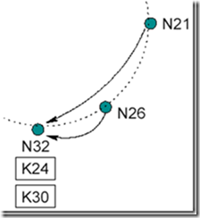

最后数据K24从N32迁移到N26.

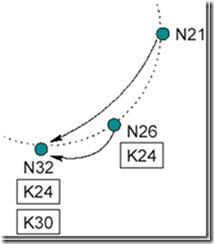

下一个周期中，N21询问其后继节点N32的前序节点是不是自己，此时发现N32的前序节点已经是N26。于是N21将其后继节点修改为N26，并通知N26为自己的后继节点，N26接到通知后将N21设置为自己的前驱节点。如下图所示：

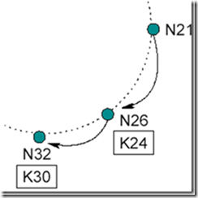
#### 加入操作会带来的影响：
1. 正确性方面：当一个节点加入系统，而一个查找发生在询问周期结束前，那么此时系统会有三个状态：
   - 所有后继指针和路由表项都正确时：对正确性没有影响。
   - 后继指针正确但表项不正确：查找结果正确，但速度稍慢（在目标节点和目标节点的后继处加入非常多个节点时）。如下图：
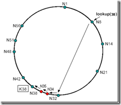
   - 后继指针和路由表项都不正确：此时查找失败，Chord上层的软件会发现数据查找失败，在一段时间后会进行重试。

2. 效率方面：当询问周期完成时，对查找效率的影响不会超过O(log N) 的时间。当询问周期未完成时，只有在目标节点和目标节点的后继处加入非常多个节点时才会有性能影响。可以证明，只要路由表调整速度快于网络节点数量加倍的速度，性能就不受影响。