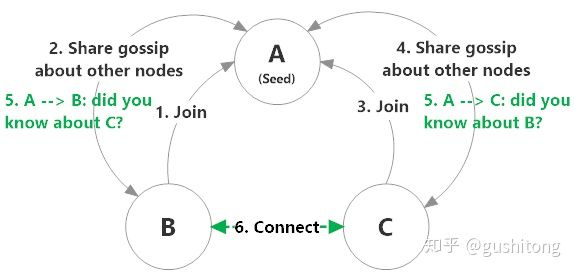
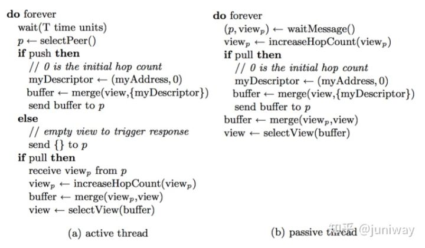
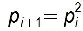
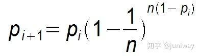

# Gossip

**背景**

Gossip protocol 也叫 Epidemic Protocol （流行病协议），实际上它还有很多别名，比如：“流言算法”、“疫情传播算法”等。

这个协议的作用就像其名字表示的意思一样，非常容易理解，它的方式其实在我们日常生活中也很常见，比如电脑病毒的传播，森林大火，细胞扩散等等。

Gossip protocol 最早是在 1987 年发表在 ACM 上的论文 《Epidemic Algorithms for Replicated Database Maintenance》中被提出。主要用在分布式数据库系统中各个副本节点同步数据之用，这种场景的一个最大特点就是组成的网络的节点都是对等节点，是非结构化网络，这区别与之前介绍的用于结构化网络中的 DHT 算法 Kadmelia。

我们知道，很多知名的 P2P 网络或区块链项目，比如 IPFS，Ethereum 等，都使用了 Kadmelia 算法，而大名鼎鼎的 Bitcoin 则是使用了 Gossip 协议来传播交易和区块信息。

实际上，只要仔细分析一下场景就知道，Ethereum 使用 DHT 算法并不是很合理，因为它使用节点保存整个链数据，不像 IPFS 那样分片保存数据，因此 Ethereum 真正适合的协议应该像 Bitcoin 那样，是 Gossip 协议。

**这里先简单介绍一下 Gossip 协议的执行过程：**

Gossip 过程是由种子节点发起，当一个种子节点有状态需要更新到网络中的其他节点时，它会随机的选择周围几个节点散播消息，收到消息的节点也会重复该过程，直至最终网络中所有的节点都收到了消息。这个过程可能需要一定的时间，由于不能保证某个时刻所有节点都收到消息，但是理论上最终所有节点都会收到消息，因此它是一个最终一致性协议。

**Gossip 演示**

现在，我们通过一个具体的实例来深入体会一下 Gossip 传播的完整过程

**为了表述清楚，我们先做一些前提设定**

1、Gossip 是周期性的散播消息，把周期限定为 1 秒

2、被感染节点随机选择 k 个邻接节点（fan-out）散播消息，这里把 fan-out 设置为 3，每次最多往 3 个节点散播。

3、每次散播消息都选择尚未发送过的节点进行散播

4、收到消息的节点不再往发送节点散播，比如 A -> B，那么 B 进行散播的时候，不再发给 A。

这里一共有 16 个节点，节点 1 为初始被感染节点，通过 Gossip 过程，最终所有节点都被感染：

**Gossip 的特点（优势）**

**1）扩展性**

网络可以允许节点的任意增加和减少，新增加的节点的状态最终会与其他节点一致。

**2）容错**

网络中任何节点的宕机和重启都不会影响 Gossip 消息的传播，Gossip 协议具有天然的分布式系统容错特性。

**3）去中心化**

Gossip 协议不要求任何中心节点，所有节点都可以是对等的，任何一个节点无需知道整个网络状况，只要网络是连通的，任意一个节点就可以把消息散播到全网。

**4）一致性收敛**

Gossip 协议中的消息会以一传十、十传百一样的指数级速度在网络中快速传播，因此系统状态的不一致可以在很快的时间内收敛到一致。消息传播速度达到了 logN。

**5）简单**

Gossip 协议的过程极其简单，实现起来几乎没有太多复杂性。

Márk Jelasity 在它的 《Gossip》一书中对其进行了归纳：

**Gossip 的缺陷**

分布式网络中，没有一种完美的解决方案，Gossip 协议跟其他协议一样，也有一些不可避免的缺陷，主要是两个：

**1）消息的延迟**

由于 Gossip 协议中，节点只会随机向少数几个节点发送消息，消息最终是通过多个轮次的散播而到达全网的，因此使用 Gossip 协议会造成不可避免的消息延迟。不适合用在对实时性要求较高的场景下。

**2）消息冗余**

Gossip 协议规定，节点会定期随机选择周围节点发送消息，而收到消息的节点也会重复该步骤，因此就不可避免的存在消息重复发送给同一节点的情况，造成了消息的冗余，同时也增加了收到消息的节点的处理压力。而且，由于是定期发送，因此，即使收到了消息的节点还会反复收到重复消息，加重了消息的冗余。

**Gossip 类型**

Gossip 有两种类型：

- Anti-Entropy（反熵）：以固定的概率传播所有的数据(只要数据不同步就开始同步数据)
- Rumor-Mongering（谣言传播）：仅传播新到达的数据(每隔固定的时间同步数据)

Anti-Entropy 是 SI model，节点只有两种状态，Suspective 和 Infective，叫做 simple epidemics。

Rumor-Mongering 是 SIR model，节点有三种状态，Suspective，Infective 和 Removed，叫做 complex epidemics。

其实，Anti-entropy 反熵是一个很奇怪的名词，之所以定义成这样，Jelasity 进行了解释，因为 entropy 是指混乱程度（disorder），而在这种模式下可以消除不同节点中数据的 disorder，因此 Anti-entropy 就是 anti-disorder。换句话说，它可以提高系统中节点之间的 similarity。

在 SI model 下，一个节点会把所有的数据都跟其他节点共享，以便消除节点之间数据的任何不一致，它可以保证最终、完全的一致。

由于在 SI model 下消息会不断反复的交换，因此消息数量是非常庞大的，无限制的（unbounded），这对一个系统来说是一个巨大的开销。

但是在 Rumor Mongering（SIR Model） 模型下，消息可以发送得更频繁，因为消息只包含最新 update，体积更小。而且，一个 Rumor 消息在某个时间点之后会被标记为 removed，并且不再被传播，因此，SIR model 下，系统有一定的概率会不一致。

而由于，SIR Model 下某个时间点之后消息不再传播，因此消息是有限的，系统开销小。

**Anti-Entropy的协调机制**
协调机制是讨论在每次2个节点通信时，如何交换数据能达到最快的一致性，也即消除两个节点的不一致性。上面所讲的push、pull等是通信方式，协调是在通信方式下的数据交换机制。协调所面临的最大问题是，因为受限于网络负载，不可能每次都把一个节点上的数据发送给另外一个节点，也即每个Gossip的消息大小都有上限。在有限的空间上有效率地交换所有的消息是协调要解决的主要问题。

在讨论之前先声明几个概念：

令N = {p,q,s,...}为需要gossip通信的server集合，有界大小
令(p1,p2,...)是宿主在节点p上的数据，其中数据有(key,value,version)构成，q的规则与p类似。
为了保证一致性，规定数据的value及version只有宿主节点才能修改，其他节点只能间接通过Gossip协议来请求数据对应的宿主节点修改。

**精确协调（Precise Reconciliation）**
精确协调希望在每次通信周期内都非常准确地消除双方的不一致性，具体表现为相互发送对方需要更新的数据，因为每个节点都在并发与多个节点通信，理论上精确协调很难做到。精确协调需要给每个数据项独立地维护自己的version，在每次交互是把所有的(key,value,version)发送到目标进行比对，从而找出双方不同之处从而更新。但因为Gossip消息存在大小限制，因此每次选择发送哪些数据就成了问题。当然可以随机选择一部分数据，也可确定性的选择数据。对确定性的选择而言，可以有最老优先（根据版本）和最新优先两种，最老优先会优先更新版本最新的数据，而最新更新正好相反，这样会造成老数据始终得不到机会更新，也即饥饿。

当然，开发这也可根据业务场景构造自己的选择算法，但始终都无法避免消息量过多的问题。

**整体协调（Scuttlebutt Reconciliation）**
整体协调与精确协调不同之处是，整体协调不是为每个数据都维护单独的版本号，而是为每个节点上的宿主数据维护统一的version。比如节点P会为(p1,p2,...)维护一个一致的全局version，相当于把所有的宿主数据看作一个整体，当与其他节点进行比较时，只需必须这些宿主数据的最高version，如果最高version相同说明这部分数据全部一致，否则再进行精确协调。

整体协调对数据的选择也有两种方法：

广度优先：根据整体version大小排序，也称为公平选择

深度优先：根据包含数据多少的排序，也称为非公平选择。因为后者更有使用价值，所有原论文更鼓励后者

**Gossip 中的通信模式**

在 Gossip 协议下，网络中两个节点之间有三种通信方式:

- Push: 节点 A 将数据 (key,value,version) 及对应的版本号推送给 B 节点，B 节点更新 A 中比自己新的数据
- Pull：A 仅将数据 key, version 推送给 B，B 将本地比 A 新的数据（Key, value, version）推送给 A，A 更新本地
- Push/Pull：与 Pull 类似，只是多了一步，A 再将本地比 B 新的数据推送给 B，B 则更新本地

如果把两个节点数据同步一次定义为一个周期，则在一个周期内，Push 需通信 1 次，Pull 需 2 次，Push/Pull 则需 3 次。虽然消息数增加了，但从效果上来讲，Push/Pull 最好，理论上一个周期内可以使两个节点完全一致。直观上，Push/Pull 的收敛速度也是最快的。

**复杂度分析**

对于一个节点数为 N 的网络来说，假设每个 Gossip 周期，新感染的节点都能再感染至少一个新节点，那么 Gossip 协议退化成一个二叉树查找，经过 LogN 个周期之后，感染全网，时间开销是 O(LogN)。由于每个周期，每个节点都会至少发出一次消息，因此，消息复杂度（消息数量 = N * N）是 O(N^2) 。注意，这是 Gossip 理论上最优的收敛速度，但是在实际情况中，最优的收敛速度是很难达到的。

假设某个节点在第 i 个周期被感染的概率为 pi，第 i+1 个周期被感染的概率为 pi+1 ，

1）则 Pull 的方式:

2）Push 方式：

显然 Pull 的收敛速度大于 Push ，而每个节点在每个周期被感染的概率都是固定的 p (0<p<1)，因此 Gossip 算法是基于 p 的平方收敛，也称为概率收敛，这在众多的一致性算法中是非常独特的。

**Gossip协议的性能**

Gossip协议的分析是基于流行病学（Epidemiology）研究的。因此在分析Gossip的性能之前，需要首先介绍一下流行病学中基本的模型。

#### Epidemiology

流行病传染最基本的模型仅作如下几个假设：

1. (n+1)(n+1)个人均匀的分布在一起
2. 每一对人群之间的传染概率是ββ，显然0<β<10<β<1.
3. 任意时刻，某个人要么处于infected的状态要么处于uninfected的状态.
4. 一旦某个人从uninfected状态转变成为infected状态，其一直停留在infected状态。

有了以上假设，我们可以进一步分析流行病的传染情况。我们记tt时刻处于infected状态的人数为ytyt，处于uninfected状态的人为xtxt，那么初始状态 y0=1y0=1, x0=nx0=n，并且在任何时候xt+yt=n+1xt+yt=n+1.

考虑连续的时间，可知：

dxdt=−βxydxdt=−βxy

解的：

x=n(n+1)n+eβ(n+1)tx=n(n+1)n+eβ(n+1)t

y=n+11+ne−β(n+1)ty=n+11+ne−β(n+1)t

明显，当t→∞t→∞时，x→0,y→(n+1)x→0,y→(n+1)，即经过足够的时间，所有的人都将被传染。

#### Gossip的性能

上述流行病传染模型为分析Gossip的性能提供了基础。在Gossip性能中，我们可以认为: β=b/nβ=b/n（因为对每个节点而言，被其他节点选中的概率就是b/nb/n)。我们令t=clog(n)t=clog(n)，可以得到:

y≈(n+1)−1ncb−2y≈(n+1)−1ncb−2

这表明，仅需要O(log(n))O(log(n))个回合，gossip协议即可将信息传递到所有的节点。 根据分析可得，Gossip协议具有以下的特点:

1. 低延迟。仅仅需要O(log(n))O(log(n))个回合的传递时间。
2. 非常可靠。仅有1ncb−21ncb−2个节点不会收到信息。
3. 轻量级。每个节点传送了cblog(n)cblog(n)次信息。

于此同时，Gossip协议的容错性比较高，例如，5050的丢包率等价于使用b/2b/2带代替bb进行分析；5050的节点错误等价于使用n/2n/2来代替nn，同时使用b/2b/2来代替bb进行分析，其分析结果不用带来数量级上的变化。
